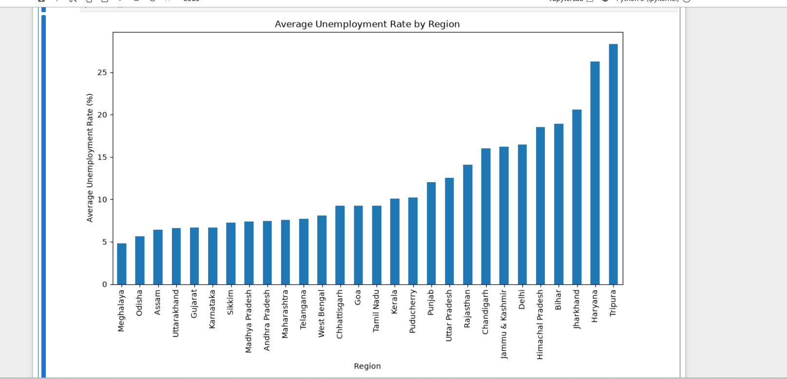
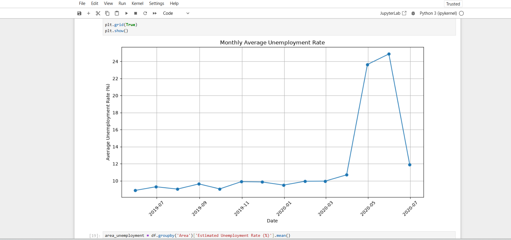
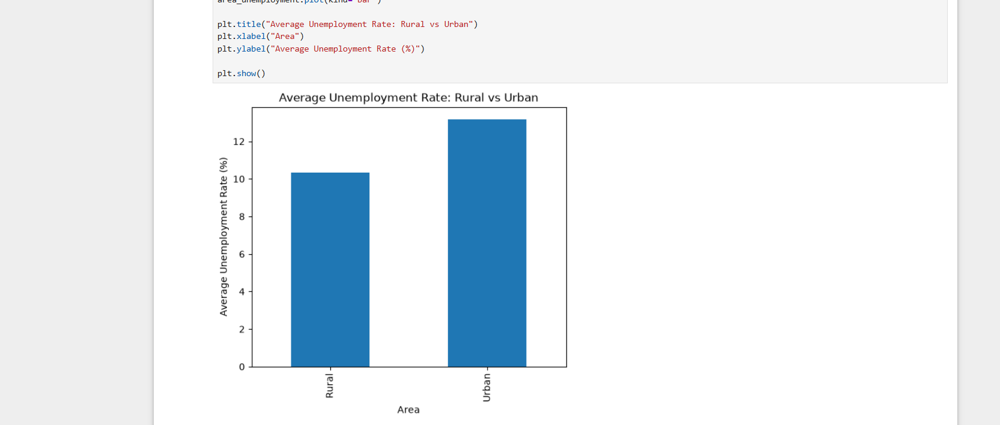

# CodeAlpha - Unemployment Analysis with Python

## 📌 Project Overview
This project was completed as part of the CodeAlpha Data Science Internship.

The objective of this project is to analyze unemployment data in India using Python. The project includes data cleaning, exploratory data analysis, and visualization to understand unemployment trends across different states and the impact of COVID-19.

---

## 🎯 Objectives

- Analyze unemployment rate data.
- Clean and preprocess the dataset.
- Perform exploratory data analysis.
- Visualize unemployment trends.
- Study the impact of COVID-19 on unemployment.
- Compare unemployment rates across different states.

---

## 🛠️ Technologies Used

- Python
- Jupyter Notebook
- Pandas
- NumPy
- Matplotlib

---

## 📂 Dataset

**Dataset Used:** Unemployment in India.csv

The dataset contains:

- Region
- Date
- Frequency
- Estimated Unemployment Rate (%)
- Estimated Employed
- Estimated Labour Participation Rate (%)
- Area (Urban/Rural)

---

## 📊 Project Workflow

### 1. Import Libraries
- Pandas
- NumPy
- Matplotlib

### 2. Load Dataset
Read the CSV file into a DataFrame.

### 3. Data Cleaning
- Removed extra spaces from column names
- Converted the Date column into datetime format
- Checked missing values
- Explored dataset information

### 4. Exploratory Data Analysis
- Dataset summary
- Statistical description
- State-wise unemployment analysis
- Monthly unemployment trends

### 5. Data Visualization
- Average unemployment rate by state
- Monthly unemployment trend
- Comparison between Rural and Urban unemployment

### 6. COVID-19 Impact
Observed a significant increase in unemployment during 2020, showing the economic impact of the COVID-19 pandemic.

---

## 📈 Results

- States showed different unemployment levels.
- COVID-19 caused a noticeable increase in unemployment.
- Rural and Urban unemployment patterns were different.
- Visualizations made trends easier to understand.

---

## 📁 Project Structure

```
CodeAlpha_UnemploymentAnalysis/
│
├── Unemployment_Analysis.ipynb
├── Unemployment in India.csv
├── README.md
└── screenshots/
```

---

## 👩‍💻 Author

**Safya Ali**

CodeAlpha Data Science 
---

# 📸 Project Screenshots

## Average Unemployment Rate by Region



---

## Monthly Average Unemployment Rate



---

## Rural vs Urban Unemployment Comparison

